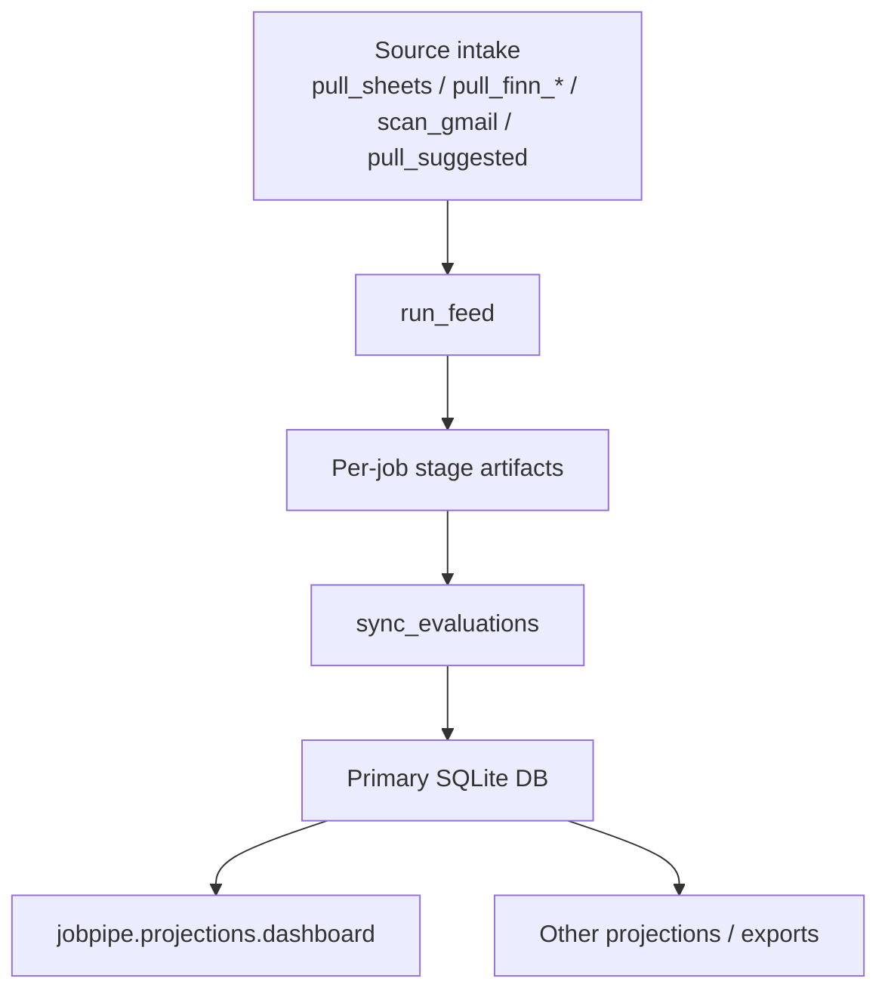
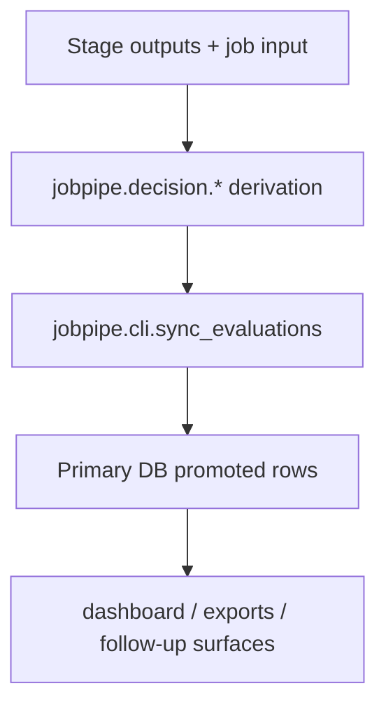
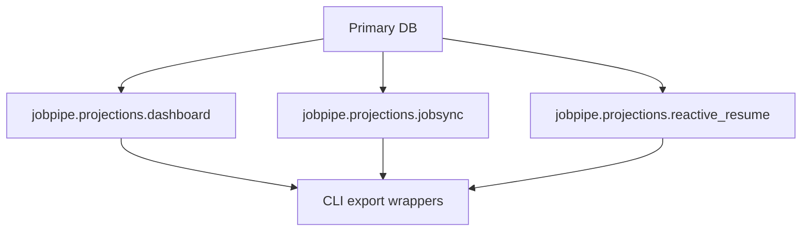
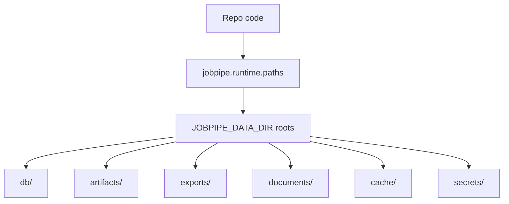

# Live Paths

This file lists the active runtime paths that matter for code changes.

It is not a backlog doc. It is a "what actually runs" map.

Read this together with:

- [docs/architecture.md](C:/Users/larsv/Jobpipe-codex-v2/docs/architecture.md)
- [jobpipe/cli/main.py](C:/Users/larsv/Jobpipe-codex-v2/jobpipe/cli/main.py)

## 1. Canonical operator path

The canonical operator entrypoint is:

```text
python -m jobpipe.cli.main ...
```

Primary commands are registered in:

- [jobpipe/cli/main.py](C:/Users/larsv/Jobpipe-codex-v2/jobpipe/cli/main.py)

The `run` command remains the normal orchestration path for the single-user loop.

## 2. Main runtime flow



## 3. Evaluation path

Current stage order from [docs/decision-model.md](C:/Users/larsv/Jobpipe-codex-v2/docs/decision-model.md):

1. `triage`
2. `parse`
3. `profile_match`
4. `pivot`
5. `moderate`
6. `application_pack`

Stage modules live under:

- [jobpipe/stages](C:/Users/larsv/Jobpipe-codex-v2/jobpipe/stages)

Important rule:

- `stages/` is the live execution path
- `decision/` is the intended canonical home for durable decision semantics

## 4. Decision-state promotion path



Key owner modules:

- [jobpipe/decision](C:/Users/larsv/Jobpipe-codex-v2/jobpipe/decision)
- [jobpipe/cli/sync_evaluations.py](C:/Users/larsv/Jobpipe-codex-v2/jobpipe/cli/sync_evaluations.py)
- [jobpipe/core/primary_db.py](C:/Users/larsv/Jobpipe-codex-v2/jobpipe/core/primary_db.py)

## 5. Projection path



Key rule:

- projections consume canonical state
- projections should not become alternate sources of truth

## 6. Connector path

Mail/Gmail provider logic is extracted under:

- [jobpipe/connectors/mail](C:/Users/larsv/Jobpipe-codex-v2/jobpipe/connectors/mail)

Operational orchestration still enters through:

- [jobpipe/cli/scan_gmail.py](C:/Users/larsv/Jobpipe-codex-v2/jobpipe/cli/scan_gmail.py)

Key rule:

- connector code normalizes provider data
- candidate/job meaning belongs elsewhere

## 7. Runtime boundary path



Key owner modules:

- [jobpipe/runtime/paths.py](C:/Users/larsv/Jobpipe-codex-v2/jobpipe/runtime/paths.py)
- [jobpipe/runtime/catalog.py](C:/Users/larsv/Jobpipe-codex-v2/jobpipe/runtime/catalog.py)

## 8. Known drift / caution zones

These paths are live but easy to mis-edit:

- `jobpipe/core/`
- `jobpipe/stages/`
- `jobpipe/cli/`

Before changing them, answer:

1. Is this the active path?
2. Is this also the canonical owner?
3. If not, should the fix land in the owner package and the live path stay thin?
