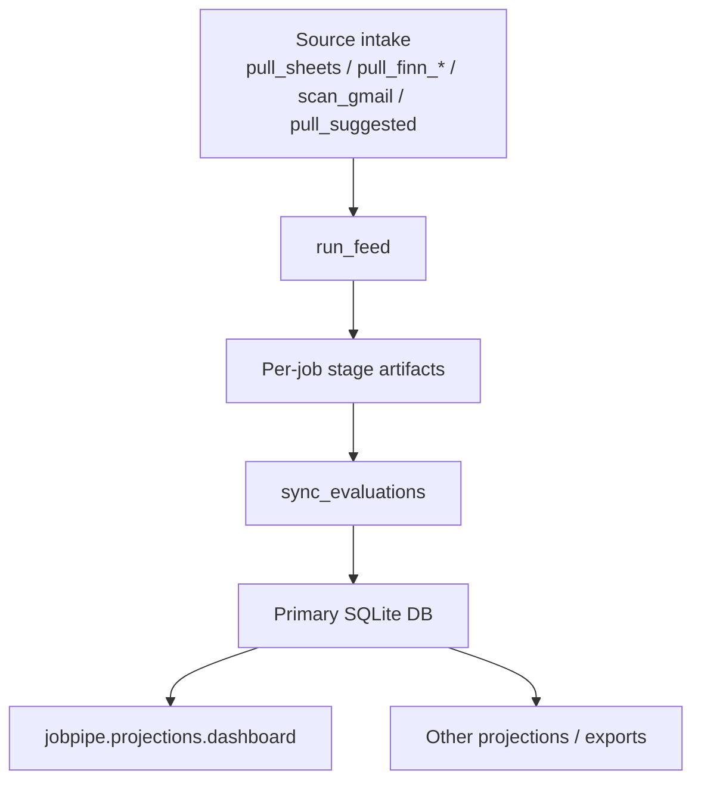
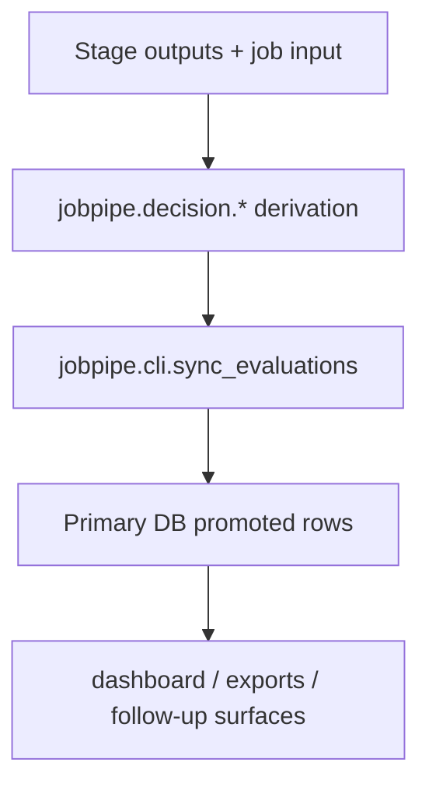
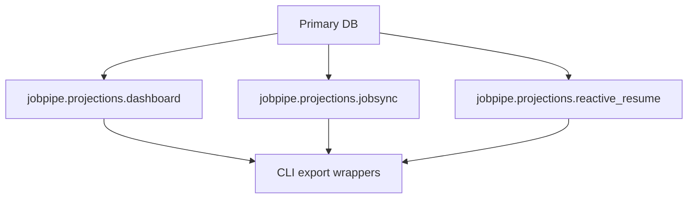
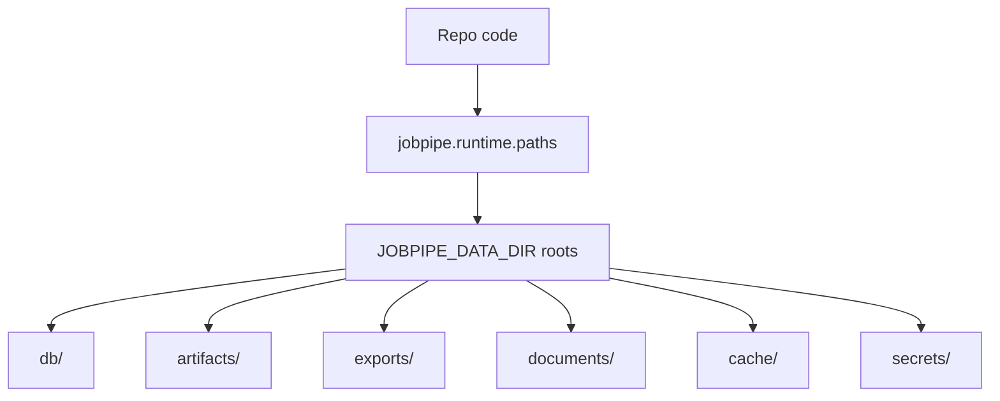

# Live Paths

This file lists the active runtime paths that matter for code changes.

It is not a backlog doc. It is a "what actually runs" map.

Read this together with:

- [docs/architecture.md](architecture.md)
- [jobpipe/cli/main.py](../jobpipe/cli/main.py)

## 1. Canonical operator path

The canonical operator entrypoint is:

```text
python -m jobpipe.cli.main ...
```

Primary commands are registered in:

- [jobpipe/cli/main.py](../jobpipe/cli/main.py)

The `run` command remains the normal orchestration path for the single-user loop.

## 2. Main runtime flow



## 3. Evaluation path

Current default stage order from [configs/pipeline.v1.yaml](../configs/pipeline.v1.yaml)
and [`jobpipe/stages/pipeline.py`](../jobpipe/stages/pipeline.py) (`SUPPORTED_DEFAULT_STAGE_ORDER`):

1. `triage` — LLM fast-filter; hard gates + semantic pre-filter; emits `TriageOut`
2. `parsed` — structured job parse; emits `JobParse`
3. `profile_match` — candidate-to-job fit dimensions; emits `ProfileMatchOut`
4. `pivot` — career-pivot risk assessment; emits `PivotOut`
5. `triage_features` — deterministic feature scoring (9 dimensions); emits `TriageFeatures`
6. `triage_decision_v3` — weighted triage label from features; emits `TriageDecisionV3`
7. `triage_ambiguity_v3` — second-pass for borderline cases; emits `TriageAmbiguityV3`
8. `advantage_assessment_v3` — competitive positioning; emits `AdvantageAssessmentV3`
9. `narrative_strategy_v3` — CV/cover-letter narrative plan; emits `NarrativeStrategyV3`
10. `moderator` — final gating decision; emits `ModeratorOut`
11. `application_pack` — full application materials (cover letter, CV highlights); emits `ApplicationPackOut`

`reverse_triage` is a supported optional stage (emits `ReverseTriageOut`) but is
disabled in the current default config. It can be re-enabled by adding it to the
`stages:` list in the YAML config.

`build_stages` in `jobpipe/stages/pipeline.py` is the single source of truth for
stage wiring. `run_feed.py` imports from it — do not add a local override there.

Stage modules live under:

- [jobpipe/stages](../jobpipe/stages)

Current stage-builder wiring lives in:

- [jobpipe/stages/pipeline.py](../jobpipe/stages/pipeline.py)

Important rule:

- `stages/` is the live execution path
- `decision/` is the intended canonical home for durable decision semantics
- `runtime/` must not import `stages/`

## 4. Decision-state promotion path



Key owner modules:

- [jobpipe/decision](../jobpipe/decision)
- [jobpipe/cli/sync_evaluations.py](../jobpipe/cli/sync_evaluations.py)
- [jobpipe/core/primary_db.py](../jobpipe/core/primary_db.py)

## 5. Projection path



Key rule:

- projections consume canonical state
- projections should not become alternate sources of truth

## 6. Connector path

Mail/Gmail provider logic is extracted under:

- [jobpipe/connectors/mail](../jobpipe/connectors/mail)

Operational orchestration still enters through:

- [jobpipe/cli/scan_gmail.py](../jobpipe/cli/scan_gmail.py)

Key rule:

- connector code normalizes provider data
- candidate/job meaning belongs elsewhere

## 7. Runtime boundary path



Key owner modules:

- [jobpipe/runtime/paths.py](../jobpipe/runtime/paths.py)
- [jobpipe/runtime/catalog.py](../jobpipe/runtime/catalog.py)

## 8. Known drift / caution zones

These paths are live but easy to mis-edit:

- `jobpipe/core/`
- `jobpipe/stages/`
- `jobpipe/cli/`

Before changing them, answer:

1. Is this the active path?
2. Is this also the canonical owner?
3. If not, should the fix land in the owner package and the live path stay thin?
